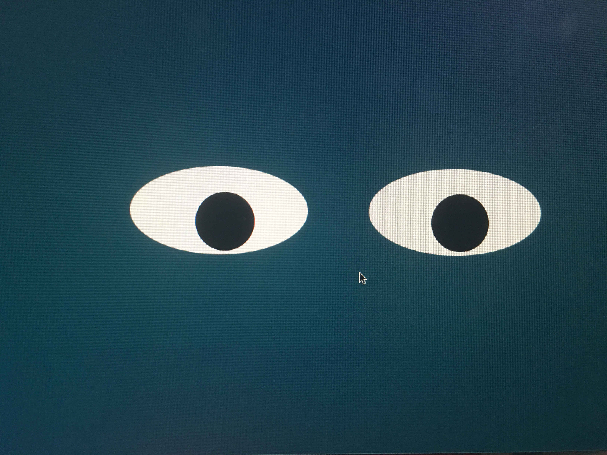

<h1 align="center">Eye Exercise</h1>

<h4 align="center">Javascript exercise in which mouse movement event is used to update the position of the "eye" element displayed on the page.</h4>
 

 

Eye Exercise
 
 

*Click to see it in action: [Eyes exercise](https://suja-codes.github.io/Eye-Exercise/)*

### Description 

- In JavaScript, events are actions that happen on a web page.

- Mouse events are a popular way to bind the DOM elements to events. 

- Example: mousemove - Triggered when the mouse moves over an element.

- In this exercise, the mouse movement event is used to update the position of the "eye" element displayed on the page. 

### To Run this Program

- Fork and Clone the repository on your local machine.

- Drag and drop the index.html file in a browser tab.

- Move the mouse around the screen.

- You will see two eyes following your mouse movements.

### Future RoadMap

This project can be still be enhanced by 

- making the eyes change color as time grows.

- changing the direction of an eye as opposed to the other. 

  
### License

This exercise stems from MIT xPRO Professional Certificate in Coding: Full Stack Development with MERN Program

> MIT License
> Copyright (c) 2022 Sujatha Arunagiri
> Permission is hereby granted, free of charge, to any person obtaining a copy
> of this software and associated documentation files (the "Software"), to deal
> in the Software without restriction, including without limitation the rights
> to use, copy, modify, merge, publish, distribute, sublicense, and/or sell
> copies of the Software, and to permit persons to whom the Software is
> furnished to do so, subject to the following conditions:
> The above copyright notice and this permission notice shall be included in all
> copies or substantial portions of the Software.
> THE SOFTWARE IS PROVIDED "AS IS", WITHOUT WARRANTY OF ANY KIND, EXPRESS OR
> IMPLIED, INCLUDING BUT NOT LIMITED TO THE WARRANTIES OF MERCHANTABILITY,
> FITNESS FOR A PARTICULAR PURPOSE AND NONINFRINGEMENT. IN NO EVENT SHALL THE
> AUTHORS OR COPYRIGHT HOLDERS BE LIABLE FOR ANY CLAIM, DAMAGES OR OTHER
> LIABILITY, WHETHER IN AN ACTION OF CONTRACT, TORT OR OTHERWISE, ARISING FROM,
> OUT OF OR IN CONNECTION WITH THE SOFTWARE OR THE USE OR OTHER DEALINGS IN THE
> SOFTWARE.
